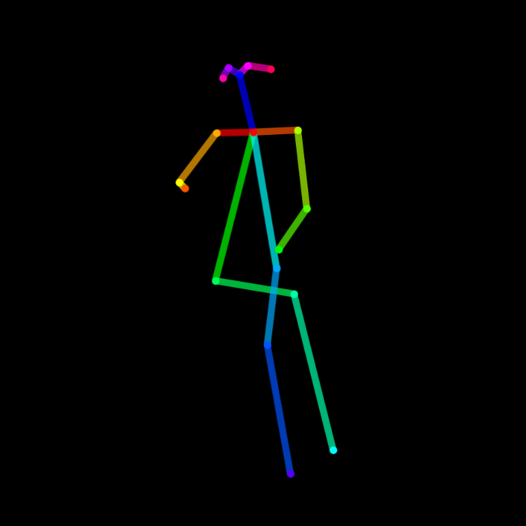

# openpose-controlnet SDXL with custom LoRa
This repository is forked from jschoormans/sdxl-openpose-LoRA-cog.

It is a cog implementation of SDXL with LoRa, trained with Replicate's [Fine-tune SDXL with your own images
](https://replicate.com/blog/fine-tune-sdxl).

This is based on [thibaud/controlnet-openpose-sdxl-1.0](https://huggingface.co/thibaud/controlnet-openpose-sdxl-1.0) and [lucataco/cog-sdxl-controlnet-openpose](https://github.com/lucataco/cog-sdxl-controlnet-openpose)

## Example:

Main inputs are a text prompt and an open pose image.

### Inputs:

"TOK person sitting"

### Output

(TODO)

with the custom LoRA SDXL model ... (TODO - open pose model)

## Changing the LoRA
To change the LoRA, edit the URL on **line 74 of script/download-weights** to point to the .tar generated by Replicate.

To train a LoRa go to [Replicate](https://replicate.com/blog/fine-tune-sdxl).

## Install and Push to Replicate with Lambda Labs

1) Create a Model on Replicate

First, create a model on Replicate by visting [replicate.com/create](https://replicate.com/create) and following the instructions.

2) Fire Up a Lamda Instance 

Next, fire up and SSH into a Lambda instance (or equivalent)/

3) Clone Depository

Clone this depository:

    git clone https://github.com/alexlawford/sdxl-boardsbot-cog.git

4) Install Cog

Install cog locally:

    curl https://replicate.github.io/codespaces/scripts/install-cog.sh | bash

5) Download Weights

CD into the directory...

    cd sdxl-boardsbot-cog

...and download the model weights (if on Lambda, as in this example, with sudo):

    sudo cog run script/downloadweights

6) Log In

Log into Cog, following the instructions that come up:

    sudo cog login

7)  Push Model

Push the model to Replicate using cog push:

    cog push r8.im/<your-username>/<your-model-name>

For example:

    sudo cog push r8.im/alexlawford/sdxl-controlnet-openpose-v2

